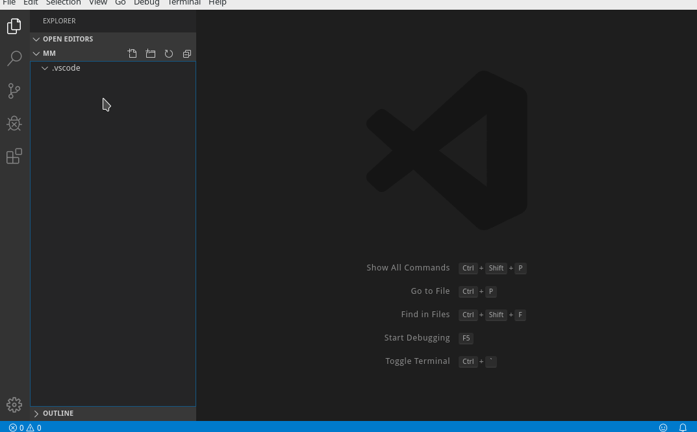
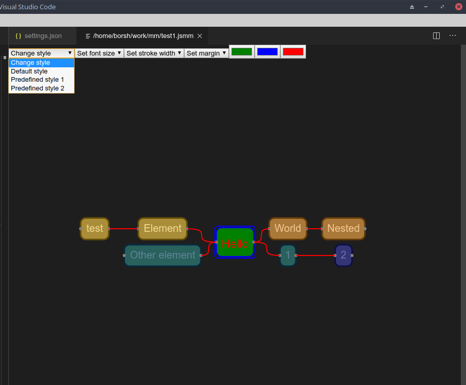

# jsmm README

jsmm is a proof of concept vscode extension for creating and editing mind maps. For now, it supports simple interactive editing. 

## Features

Create json documents with custom schema (.jsmm) and edit it interactively.  
Mind map elements
- Add 
- Update 
- Delete 
- Modify element style 

## Configuration

You can configure styles, which will be availabe in the visusal editor in the configuration file. Edit the "jsmm.definedStyles" section :

sample settings.json section:


```
{
    "jsmm.definedStyles": [
        {
            "name": "Predefined style 1",
            "backgroundColor": "green",
            "fontColor": "red",
            "fontSize": 23,
            "margin": {
                "bottom": 10,
                "left": 10,
                "right": 10,
                "top": 20
            },
            "rx": 10,
            "strokeColor": "#0000FF",
            "strokeWidth": "2"
        },
        {
            "name": "Predefined style 2",
            "backgroundColor": "blue",
            "fontColor": "white",
            "fontSize": 12,
            "margin": {
                "bottom": 5,
                "left": 5,
                "right": 5,
                "top": 5
            },
            "rx": 5,
            "strokeColor": "#black",
        }
    ]
}
```

Then in the visual editor you have the following avaliable styles:




# Usage

Create file with .jsmm extension, json schema will be used and prompted. User button in the toolbar or command "Open jsmm view" to toggle interactive editing. 

## Release Notes

### 0.3.0

Added basic node style support: background color, border color, border width, font color, font size. Child nodes inherit parent's node style. You can configure predefined node styles in config. 

### 0.2.1

Small usability improvements : arrow key navigation (default keybindings: left, right, top, bottom), cancel editing command (default keybinding : escape), edit current node command (default keybinding: f2)

### 0.2.0

Added vscode commands: js mind map: add child (default keybinding ctrl+enter),js mind map: add sibiling (default keybinding shift+enter), js mind map:remove (default keybinding delete)

### 0.1.0

Initial release of jsmm
